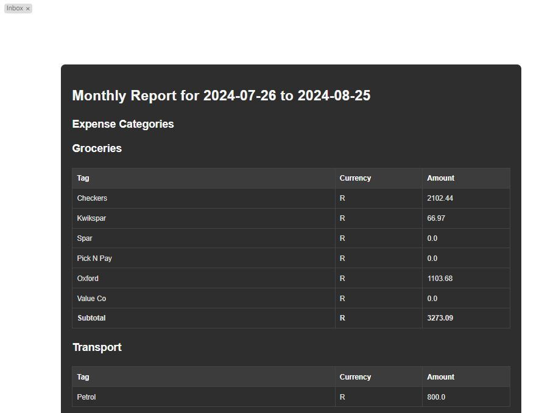

<h1>Monthly Report Generator</h1>  

<h2>Overview</h2>
A Fireflyiii report based on tags. Idea and inspiration from:  
https://github.com/davidschlachter/firefly-iii-email-summary

Instead of categories, it uses tags which are defined in the .env file.  

<h3>Requirements</h3>
Python 3.7+  

Required Python packages: requests, beautifulsoup4, python-dotenv, smtplib, ssl, email

<h3>Installation</h3>
<h4>Install Dependencies:</h4>
pip install requests beautifulsoup4 python-dotenv  

<h4>Setup .env File</h4>  
sudo cp example.env .env 
Enter your own details in .env.  Note the format of HEADERS_AND_TAGS. It is a list of dictionaries, where Title is the Table Heading, and Tags will be the total of all entries with that Tag for the defined period. 
Screenshot: 

